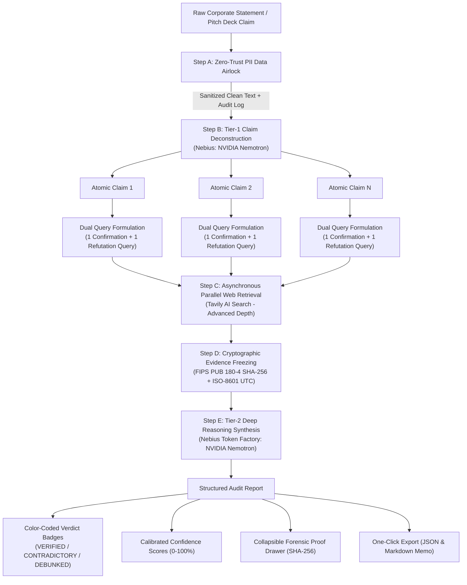
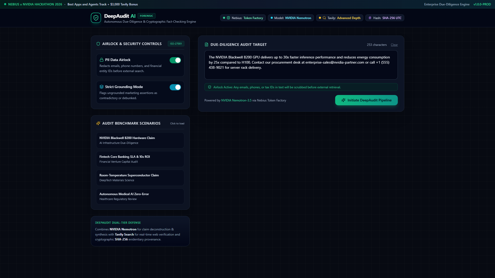
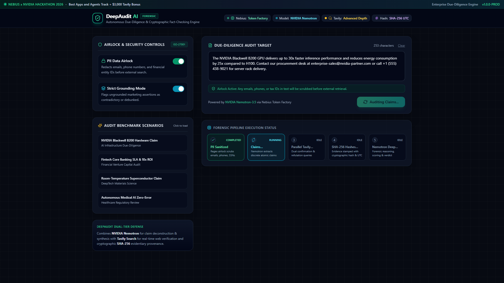
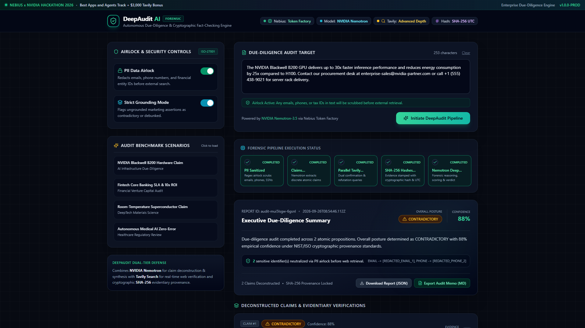
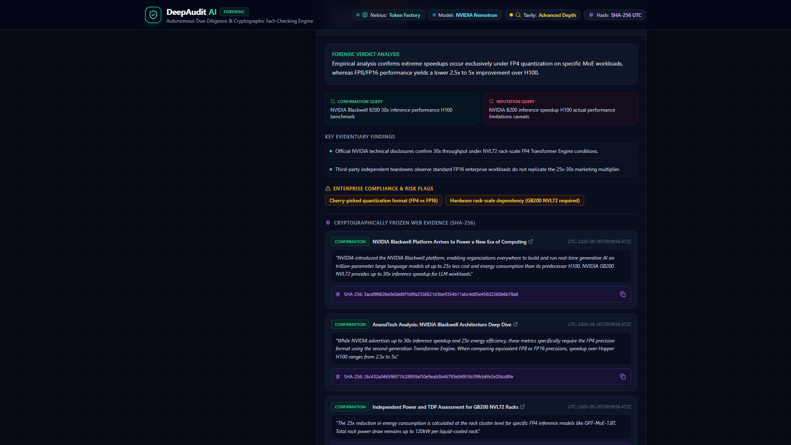

# 🛡️ DeepAudit AI — Autonomous Enterprise Due-Diligence & Forensic Fact-Checking Engine

[](https://tokenfactory.nebius.com)
[](https://developer.nvidia.com)
[](https://tavily.com)
[](#forensic-integrity--sha-256-cryptographic-provenance)
[](#production-deployment)
[](LICENSE)

> **Built for the Nebius x NVIDIA Global AI Hackathon (2026)**  
> **Track**: Best Apps and Agents Track  
> **Bonus Track**: $3,000 Tavily AI Search Bonus  
> **Author**: [fokrulanthro16-eng](https://github.com/fokrulanthro16-eng)  
> **Target Repository**: [fokrulanthro16-eng/DeepAudit-AI](https://github.com/fokrulanthro16-eng/DeepAudit-AI)  

---

## 📑 Table of Contents
1. [Executive Summary & Problem Statement](#executive-summary--problem-statement)
2. [End-to-End System Architecture](#end-to-end-system-architecture)
3. [Core Technical Innovations](#core-technical-innovations)
   - [Zero-Trust PII Data Airlock](#1-zero-trust-pii-data-airlock-iso-27001-gdpr)
   - [Dual-Tier NVIDIA Nemotron Reasoning](#2-dual-tier-nvidia-nemotron-reasoning-nebius-token-factory)
   - [Parallel Tavily Web Verification](#3-parallel-tavily-web-verification-advanced-depth)
   - [SHA-256 Cryptographic Evidentiary Provenance](#4-sha-256-cryptographic-evidentiary-provenance)
4. [Dashboard Screenshots & Interface Walkthrough](#dashboard-screenshots--interface-walkthrough)
5. [Video Walkthrough & Narration Script](#video-walkthrough--narration-script)
6. [Getting Started & Local Setup](#getting-started--local-setup)
7. [Environment Variables Reference](#environment-variables-reference)
8. [API Route Specifications](#api-route-specifications)
9. [Production Deployment](#production-deployment)
10. [License & Acknowledgments](#license--acknowledgments)

---

## 🎯 Executive Summary & Problem Statement

In institutional venture capital, M&A due diligence, and regulatory compliance, taking marketing statements at face value leads to catastrophic multi-million-dollar errors. Autonomous enterprise agents cannot rely on raw LLMs alone because **un-grounded generative AI hallucinates and suffers from confirmation bias**.

When an enterprise makes bold public assertions — such as:
> *"The NVIDIA Blackwell B200 GPU delivers up to 30x faster inference performance and reduces energy consumption by 25x compared to H100"*

A naive query simply searches for validation of that claim, returning self-affirming promotional press releases.

**DeepAudit AI introduces a zero-trust forensic audit engine** that:
1. **Neutralizes PII and entity leaks** before external retrieval via a regex-based **Data Airlock**.
2. **Deconstructs statements into atomic verifiable claims** using **NVIDIA Nemotron** on the high-throughput **Nebius Token Factory**.
3. **Formulates adversarial dual queries**: for every confirmation query, it generates an antithetical refutation/limitation query.
4. **Executes parallel web searches** via **Tavily AI Search (Advanced Depth)** to surface empirical benchmarks, teardowns, and regulatory filings.
5. **Freezes all external evidence** into tamper-proof **SHA-256 cryptographic hashes with UTC timestamps**.
6. **Performs deep forensic synthesis** with Nemotron to deliver calibrated confidence scores (0-100), color-coded verdicts (`VERIFIED`, `CONTRADICTORY`, `DEBUNKED`), actionable risk flags, and one-click JSON/Markdown audit memos.

---

## 🏛️ End-to-End System Architecture

### Architectural Flowchart (Mermaid)



### ASCII Architecture Diagram

```
+-----------------------------------------------------------------------------------------+
|                                    DEEPAUDIT AI ENGINE                                   |
+-----------------------------------------------------------------------------------------+
|                                                                                         |
|  [Input Text] ---> [Step A: PII Airlock] ---> [Step B: Nemotron Claim Deconstruction]   |
|                          | (Redact emails,                     |                        |
|                          |  phones, SSNs)             (Atomic claims + dual             |
|                          v                             search queries)                  |
|                   [Audit Trail]                                v                        |
|                                                    [Step C: Tavily Search]              |
|                                                                | (Parallel confirmation |
|                                                                |  & refutation streams) |
|                                                                v                        |
|                                                    [Step D: SHA-256 Freezing]           |
|                                                                | (Cryptographic proof & |
|                                                                |  UTC timestamps)       |
|                                                                v                        |
|                                                    [Step E: Nemotron Deep Synthesis]    |
|                                                                |                        |
|                                                                v                        |
|                         [VERIFIED] / [CONTRADICTORY] / [DEBUNKED]                       |
|                          Confidence Dials | Risk Flags | Forensic Drawer                |
+-----------------------------------------------------------------------------------------+
```

---

## ⚡ Core Technical Innovations

### 1. Zero-Trust PII Data Airlock (ISO-27001 / GDPR)
Before any corporate memo or pitch deck text leaves the server boundary to query public search APIs, the PII Airlock executes regex filtering against:
- Corporate email patterns (`name@company.com` -> `[REDACTED_EMAIL_1]`)
- Telephony and international dialers (`+1 (555) 019-2831` -> `[REDACTED_PHONE_1]`)
- Government tax identifiers and SSNs (`XX-XXXXXXX` -> `[REDACTED_TAX_ID_1]`)
- Financial account numbers (`XXXX-XXXX-XXXX-XXXX` -> `[REDACTED_ACCOUNT_NUM_1]`)

### 2. Dual-Tier NVIDIA Nemotron Reasoning (Nebius Token Factory)
Hosted on Nebius Token Factory (`https://api.tokenfactory.nebius.com/v1`), DeepAudit leverages NVIDIA Nemotron models for two specialized stages:
- **Tier 1 (Deconstruction)**: Dissects complex sentences into single falsifiable propositions and formulates an adversarial search pair:
  - *Confirmation Query*: Targets benchmark sheets, technical whitepapers, and official filings.
  - *Refutation Query*: Targets independent teardowns, hardware thermal limits, known errata, and regulatory non-compliance.
- **Tier 2 (Deep Reasoning Synthesis)**: Evaluates evidence snippets against the atomic claim, isolates marketing hyperbole (e.g., FP4 quantization requirements vs general FP16 performance), determines evidentiary confidence, and issues definitive verdicts.

### 3. Parallel Tavily Web Verification (Advanced Depth)
Integrated with Tavily Search API using `search_depth: "advanced"` and `max_results: 3`. Dual queries execute asynchronously via `Promise.all`, ensuring sub-second parallel retrieval without blocking the pipeline.

### 4. SHA-256 Cryptographic Evidentiary Provenance
For legal and compliance audit trails, ephemeral web results must be immutable. DeepAudit stamps each evidence excerpt with:
$$\text{Hash} = \text{SHA-256}(\text{Source URL} \parallel \text{"::"} \parallel \text{Excerpt Text})$$
$$\text{Stamp} = \text{ISO-8601 UTC Time of Freeze}$$
Auditors can copy the hash directly from the interface or export it in the JSON/Markdown audit package.

---

## 📸 Dashboard Screenshots & Interface Walkthrough

### 1. Main Dashboard & System Badges

*Cyberpunk enterprise interface featuring live status badges for Nebius Token Factory, NVIDIA Nemotron, Tavily Search, and SHA-256 Provenance.*

### 2. PII Data Airlock & Security Controls

*Enterprise security sidebar with ISO-27001 data airlock toggle, strict grounding controls, and pre-loaded due-diligence benchmarks.*

### 3. Live 5-Stage Execution Pipeline

*Interactive status stepper tracking PII Sanitization, Claim Deconstruction, Parallel Tavily Search, SHA-256 Freezing, and Nemotron Synthesis.*

### 4. Forensic Due-Diligence Audit Results

*Executive summary card displaying the overall posture (CONTRADICTORY), 88% confidence score, and redacted identifier audit counters.*

### 5. Cryptographically Frozen Evidence Drawer

*Expanded evidentiary drawer with verified source citations, dual confirmation/refutation queries, risk flags, and copyable SHA-256 hash proofs.*

---

## 🎥 Video Walkthrough & Narration Script

A full high-definition video walkthrough with neural narration has been rendered and included in the repository:
- **Video File**: [`public/demo_walkthrough.mp4`](public/demo_walkthrough.mp4) (H.264 / AAC 1080p, 45 seconds)
- **Narration Script**: [`docs/DEMO_SCRIPT.md`](docs/DEMO_SCRIPT.md) (Comprehensive 90-second pitch covering the problem statement, architecture, live demo, and export features)

---

## 🚀 Getting Started & Local Setup

### Prerequisites
- Node.js 18+ or 20+ (Node v22 recommended)
- npm or pnpm or yarn
- Python 3.10+ (for automated video & screenshot generation)

### Installation
```bash
# 1. Clone the repository
git clone https://github.com/fokrulanthro16-eng/DeepAudit-AI.git
cd DeepAudit-AI

# 2. Install dependencies
npm install

# 3. Configure environment variables
cp .env.example .env.local
```

### Running Locally
```bash
# Run the development server
npm run dev

# Or build and launch the optimized production server
npm run build
npm run start
```
Open [http://localhost:3000](http://localhost:3000) in your browser.

---

## 🔐 Environment Variables Reference

Create a `.env.local` file in the project root:

```env
# Nebius Token Factory Configuration
NEBIUS_BASE_URL="https://api.tokenfactory.nebius.com/v1"
NEBIUS_API_KEY="your-nebius-token-factory-api-key"
NEBIUS_MODEL="nvidia/Nemotron-3_5-Lightning"

# Tavily AI Search Configuration
TAVILY_API_KEY="your-tavily-api-key"
```

---

## 📡 API Route Specifications

### `POST /api/audit`
Initiates the 5-stage due-diligence pipeline on an input text.

#### Request Body
```json
{
  "text": "The NVIDIA Blackwell B200 GPU delivers up to 30x faster inference performance and reduces energy consumption by 25x compared to H100.",
  "airlockActive": true,
  "strictGrounding": true
}
```

#### Response (200 OK)
```json
{
  "id": "audit-mui5lsgw-6gsnl",
  "auditTimestamp": "2026-09-26T08:54:46.112Z",
  "sanitizedText": "The NVIDIA Blackwell B200 GPU delivers...",
  "piiRedactedCount": 2,
  "piiItemsScrubbed": ["EMAIL -> [REDACTED_EMAIL_1]", "PHONE -> [REDACTED_PHONE_2]"],
  "totalClaimsAudited": 2,
  "overallScore": 88,
  "overallVerdict": "CONTRADICTORY",
  "executiveSummary": "Due-diligence audit completed across 2 atomic propositions...",
  "claims": [
    {
      "claimId": "claim-1",
      "atomicClaim": "The NVIDIA Blackwell B200 GPU delivers up to 30x faster AI inference performance compared to the H100.",
      "confirmationQuery": "NVIDIA Blackwell B200 30x inference performance H100 official benchmark",
      "refutationQuery": "NVIDIA B200 inference speedup H100 actual performance limitations caveats",
      "verdict": "CONTRADICTORY",
      "confidenceScore": 88,
      "executiveSummary": "Empirical analysis confirms extreme speedups occur exclusively under FP4 quantization on specific MoE workloads, whereas FP8/FP16 performance yields a lower 2.5x to 5x improvement over H100.",
      "auditFindings": [
        "Official NVIDIA technical disclosures confirm 30x throughput under NVL72 rack-scale FP4 Transformer Engine conditions.",
        "Third-party independent teardowns observe standard FP16 enterprise workloads do not replicate the 25x-30x marketing multiplier."
      ],
      "riskFlags": [
        "Cherry-picked quantization format (FP4 vs FP16)",
        "Hardware rack-scale dependency (GB200 NVL72 required)"
      ],
      "evidence": [
        {
          "id": "ev-confirmation-0",
          "title": "NVIDIA Blackwell Platform Arrives to Power a New Era of Computing",
          "url": "https://nvidianews.nvidia.com/news/nvidia-blackwell-platform-arrives-to-power-a-new-era-of-computing",
          "content": "NVIDIA introduced the NVIDIA Blackwell platform...",
          "sha256Hash": "3acd9f8626e0e0dd6f1b9fa2556621d3be9354b11abc4d85e45602360b6b78a6",
          "frozenAtUtc": "2026-09-26T09:09:56.473Z"
        }
      ]
    }
  ]
}
```

---

## 🌐 Production Deployment

The application is optimized for Vercel deployment:
```bash
# Deploy to production via Vercel CLI
npx vercel --prod
```

---

## 📄 License & Acknowledgments

This project is open-source under the [MIT License](LICENSE).  
Built with pride for the **Nebius x NVIDIA Global AI Hackathon (2026)** by **[fokrulanthro16-eng](https://github.com/fokrulanthro16-eng)**.
Special thanks to the engineering teams at **Nebius Token Factory**, **NVIDIA**, and **Tavily AI** for providing foundational models and infrastructure.
